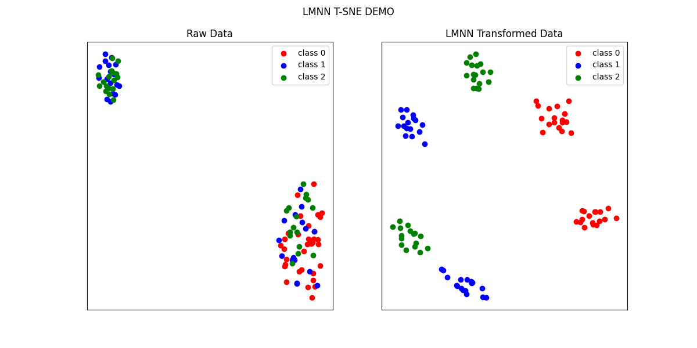
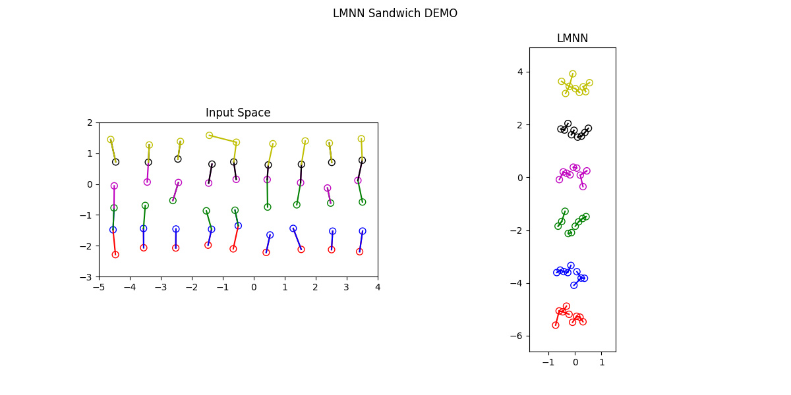
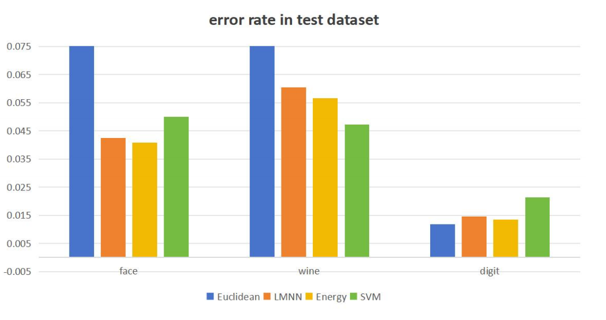

# LMNN: Distance Metric Learning for Large Margin Nearest Neighbor Classification

This project implements **LMNN** (Large Margin Nearest Neighbor Classification) from scratch using only **NumPy**, without relying on automated gradient tools like PyTorch.

## Highlights
- Core implementation is in **`lmnn_lmpl.py`**.
- Utilizes advanced masking techniques and batch operations for high training efficiency.

## Getting Started

1. Clone the repository:
   ```bash
   git clone https://github.com/your-repo-name/lmnn
   cd lmnn
   '''
2. To run clustering demos
   ```bash
   python lmnn_demos.py
   '''
   then you can get two images visulizing the clustering performance.

  
  
  
   
3. To run experiments
   ```bash
   python lmnn_app.py --task TASK_NAME
   '''
   and chose TASK_NAME from "faces","digits","wines", then you can get corrresponding results as well as baselines' performance,
   The results will be like
   
